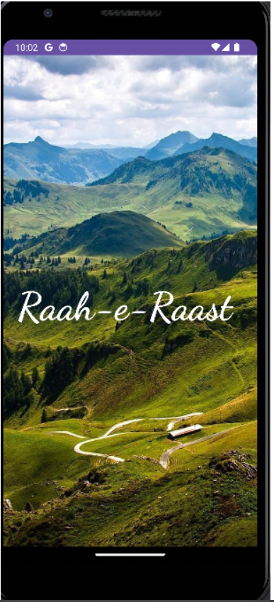
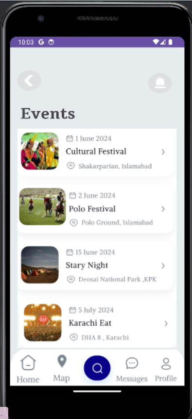

# Raah-e-Raast Travel App

## Project Description

Raah-e-Raast is an all-encompassing travel and local exploration application designed to provide users with a seamless experience in discovering and navigating new places. It offers location-based recommendations, activity-based suggestions, interactive maps, reviews, ratings, an event calendar, local discounts, language translation, emergency contacts, and real-time weather integration. With a focus on enhancing the travel journey, Raah-e-Raast aims to be the ultimate companion for adventurers and explorers.

### Folders
#### Drawables
-consisting of all shapes and vectors 
#### Layout 
-consisting of all Xml files
#### Values 
-conisiring of colours and string

### Application Features

- **Local Data Storage:** Users can save favorite locations, reviews, and personalized notes offline.
- **Data Sync:** Automatic synchronization when connected to the internet.
- **Cloud Storage:** Securely store and manage travel recommendations, reviews, and user-generated content on the cloud.
- **Interactive Maps:** Dynamic maps with marked points of interest, activity-based suggestions, and event locations.
- **Image Handling:** Users can upload images of their travel experiences.
- **Lists and Search Boxes:** Organized lists for saved places, activity-based recommendations, and personalized notes.
- **SignUp and Login:** User authentication via email or mobile number.
- **Push Notifications:** Notify users about new local recommendations, upcoming events, and personalized discounts.
- **Location-Based Recommendations:** AI-driven suggestions based on user preferences, location, and activity interests.
- **Activity-Based Recommendations:** Recommendations tailored to user interests and preferred activities.
- **Reviews and Rating:** Users can leave reviews and ratings for places they visit, contributing to a community-driven platform.
- **Event Calendar:** Calendar feature showcasing local events, festivals, and activities.
- **Local Discounts:** Access to exclusive discounts and offers from local businesses and establishments.
- **Emergency Contacts:** Easily accessible emergency contacts and information.
- **Place Description:** Places to visit in Pakistan and their description including location, reviews, and upcoming events.
- **Messaging System:** Travelers can interact with tour guides asking for any help or recommendations.

### Application Architecture

**Front-end Development:** Utilizing modern UI/UX design principles for an intuitive and visually appealing user interface. Integration of interactive elements for a seamless and engaging user experience.

**Back-end Development:** Robust server infrastructure for efficient data storage, synchronization, and real-time updates. Secure APIs for seamless communication between the front-end and back-end systems.

## Screenshots

